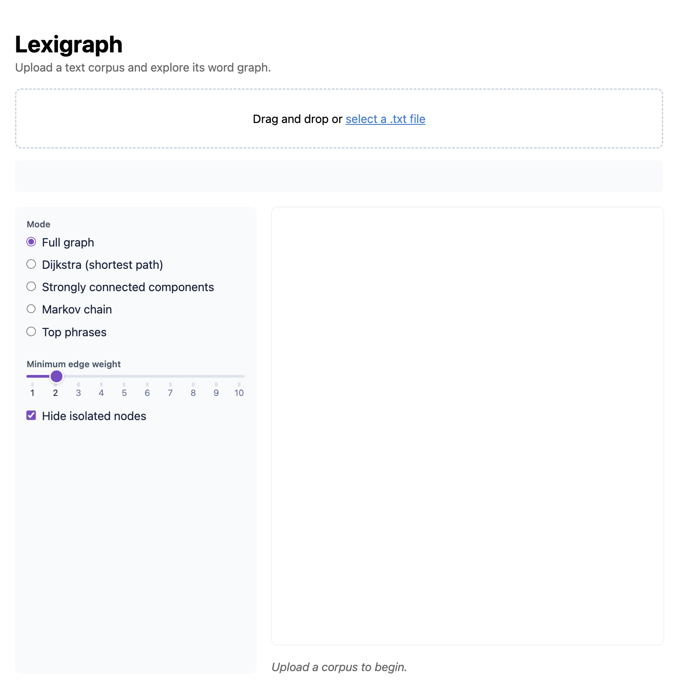
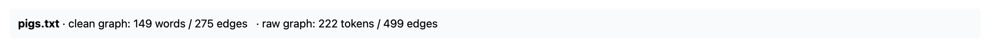
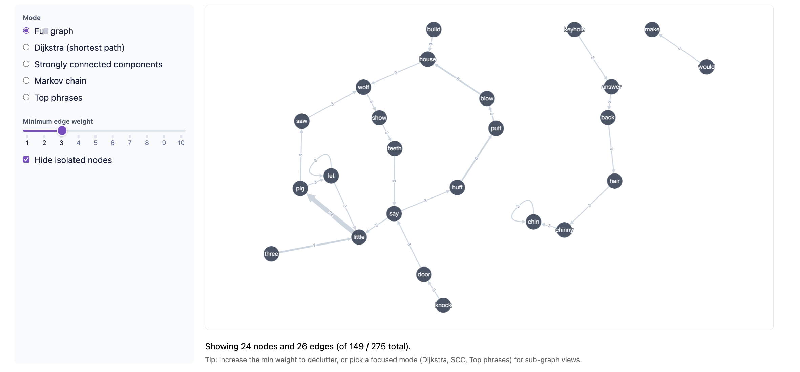
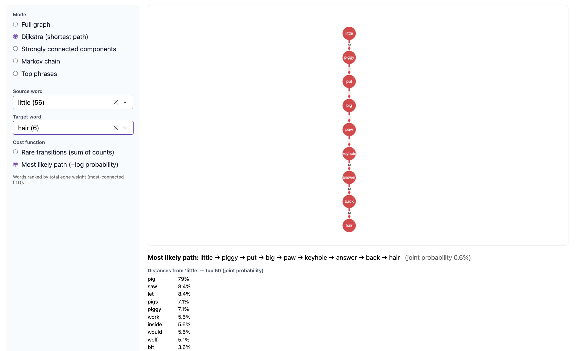
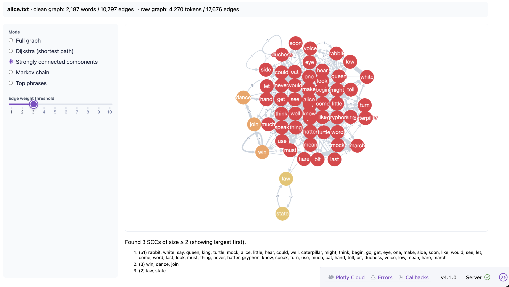
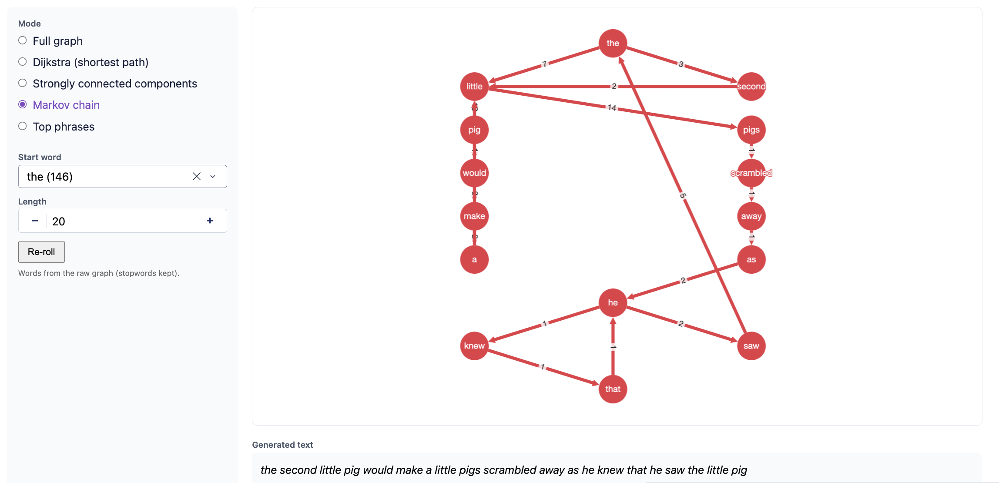
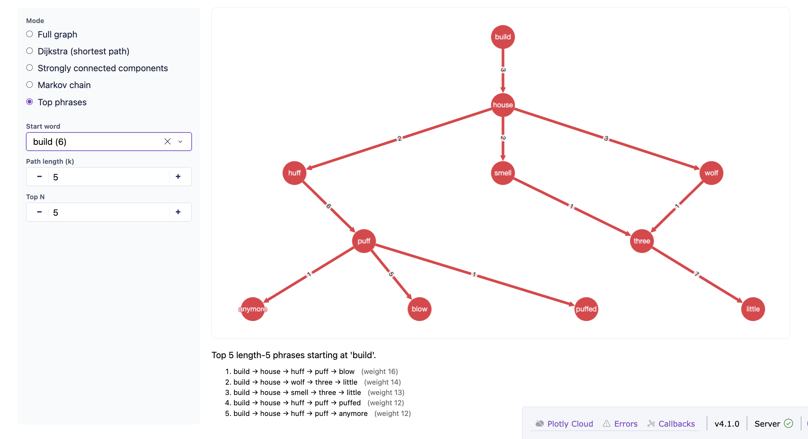

# Lexigraph User Manual

Lexigraph turns a text corpus into a directed weighted word graph (nodes = words, edges = consecutive-word adjacencies, weights = co-occurrence counts) and lets you explore it interactively.

## Structure

We have files that enable the algorithmic computations, and files that enable user interactions.

### Algorithmic Files
- `dijkstra.py`: Dijkstra's shortest-path algorithm. Two cost modes: `weight` (sum of raw edge counts = rarest-transition path) and `neglog` (−log transition probability  = most-likely path).
- `kosaraju.py`: Kosaraju's two-pass DFS for strongly connected components, parameterized by a minimum edge-weight threshold.
- `markov.py`: Weighted random walk over the graph, used to generate text from a starting word.
- `path_finder.py`: Backtracking DFS that enumerates length-*k* paths from a start word and returns the top-*N* by total edge weight.

### User Interaction Files
- `loader.py`: Parses a `.txt` corpus into a graph. `loader_clean*` lemmatizes and removes stopwords (used by Dijkstra, SCC, Top phrases); `loader_raw*` lowercases and strips punctuation only (used by Markov, where surface form matters).
- `graph_utils.py`: Helpers shared by the UI; filtering by edge weight, computing node strengths (used to rank dropdowns), extracting subgraphs from paths/SCCs, and converting graphs into Cytoscape's element format.
- `app.py`: Dash + dash-cytoscape application. Owns the layout, callbacks, and in-memory corpus cache.

## Usage

```bash
pip install -r requirements.txt
```
Select one of the following commands to start the server:
```bash
python app.py                    # default: http://127.0.0.1:8050
python app.py --port 9123        # custom port
python app.py --host 0.0.0.0     # expose on LAN
python app.py --no-debug         # disable Dash hot-reload
```

Access the Flask server in your browser at the printed URL. 

## Application Functionality



**Uploading a corpus.** Drag a `.txt` file onto the upload zone (or click to browse). Two graphs are built and cached: the *clean* (lemmatized, stopwords removed) and the *raw* (preserved as-is). The header shows token/edge counts for both.



**Mode selector.** Pick one of five modes from the sidebar.

| Mode | Graph | What it does |
|---|---|---|
| **Full graph** | clean | Filtered view of the whole word graph. |
| **Dijkstra** | clean | Shortest path between two words. |
| **SCC** | clean | Strongly connected components above a weight threshold. |
| **Markov** | raw | Generates a random walk (readable English-ish text). |
| **Top phrases** | clean | Highest-weight length-*k* paths from a start word. |

### Full graph
- **Minimum edge weight** (slider): drops edges below the threshold. Default 2 to strip weight-1 edges.
- **Hide isolated nodes** (toggle): hides nodes left with no edges after filtering.
- If the filtered graph still has more than 500 nodes, rendering is skipped with a warning to protect the browser.



### Dijkstra
- **Source** and **Target** (searchable dropdowns, ranked by node strength)
- **Cost function** (radio):
  - *Rare transitions*: sums raw edge counts = shortest path uses **least common** word adjacencies
  - *Most likely path* — sums −log(transition probability) = 'shortest' path uses **highest joint probability**



### Strongly connected components
- **Edge weight threshold**: only edges with weight >= threshold are considered when finding SCCs.
- Every SCC of size >= 2 is rendered, each component colored differently.



### Markov chain
- **Start word**: (searchable dropdown, ranked by node strength)
- **Length**: number of words to generate
- **Re-roll** button: resamples a different walk with the same parameters
- The generated text is shown verbatim; the walk is also drawn as a chain in the graph.



### Top phrases
- **Start word**, **Path length (k)**, **Top N**.
- Returns the *N* highest-weight length-*k* paths from the start word (no node repeats). Phrases use the clean graph, so they read as content-word sequences rather than literal text.
- All *N* paths are drawn together; the results panel lists each phrase with its total weight.



### Reading the visualizations

- **Edges** are directed, labeled by weight, and width scaled by weight
- **Nodes** highlighted in red are part of the active result (a path, walk, or SCC member)